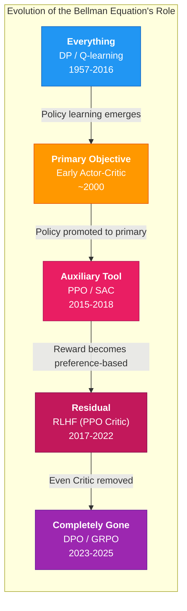

# RL Evolution Roadmap: From the Bellman Equation to Preference Learning

## Core Evolution Path

The diagram below shows the **conceptual evolution** of RL from classical dynamic programming to modern preference learning, annotating the core turning points at each stage and the shifting role of the Bellman equation.

```mermaid
flowchart TD
    subgraph ERA1["<b>Stage 1: Deterministic DP (1957)</b>"]
        A["<b>Birth of the Bellman Equation</b><br/>Richard Bellman, 1957<br/>─────────────────<br/>V(s) = max_a [r + γ·V(s')]<br/>Deterministic environment, fully known model<br/>Bellman equation = the entire optimization"]
    end

    subgraph ERA2["<b>Stage 2: Stochastic DP / MDP (1960)</b>"]
        B["<b>Stochastic Dynamic Programming</b><br/>Ronald Howard, 1960<br/>─────────────────<br/>V(s) = max_a E[r + γ·V(s')]<br/>Introduces transition probabilities P(s'|s,a)<br/>Policy Iteration / Value Iteration<br/>Bellman equation = the entire optimization (stochastic)"]
    end

    subgraph ERA3["<b>Stage 3: Model-Free V Learning (1988)</b>"]
        C["<b>TD Learning</b><br/>Richard Sutton, 1988<br/>─────────────────<br/>V(s) ← V(s) + α[r + γ·V(s') - V(s)]<br/>No model needed, learn from samples<br/>V is stable, low variance, but can't select actions<br/>Bellman equation = the entire optimization (sampled)"]
    end

    subgraph ERA4["<b>Stage 4: Q-learning / Qmax (1989)</b>"]
        D["<b>Q-Learning</b><br/>Chris Watkins, 1989<br/>─────────────────<br/>Q(s,a) ← r + γ·max_a' Q(s',a')<br/>From V to Q: explicit action-value recording<br/>argmax Q selects actions directly, no model needed<br/>Off-policy, high data efficiency<br/>Bellman equation = the entire optimization"]
    end

    subgraph ERA5["<b>Stage 5: Deep Q / Taming Qmax (2013-2016)</b>"]
        E["<b>DQN → Double DQN → Dueling DQN</b><br/>DeepMind, 2013-2016<br/>─────────────────<br/>Discovered: max amplifies noise → overestimation<br/>Replay Buffer / Target Network / Double Q<br/>Essence: putting reins on Qmax<br/>Bellman equation = the entire optimization (+ stability tricks)"]
    end

    subgraph ERA6["<b>⚡ Turning Point: Introducing Policy Learning (1992/2000)</b>"]
        F["<b>REINFORCE / Policy Gradient Theorem</b><br/>Williams 1992 · Sutton et al. 1999<br/>─────────────────<br/>∇J = E[∇log π(a|s) · A(s,a)]<br/>Begin directly optimizing policy distribution<br/>But in early Actor-Critic:<br/>Critic still approximates Q, target is still Bellman consistency<br/>Bellman equation = primary objective (policy is a means)"]
    end

    subgraph ERA7["<b>⚡⚡ Key Turn: Policy Becomes Primary (2015-2018)</b>"]
        G["<b>TRPO → PPO → TD3 → SAC</b><br/>Schulman 2015/2017 · Fujimoto 2018 · Haarnoja 2018<br/>─────────────────<br/>Optimization target: max E_π[R(τ)] (not Bellman consistency)<br/>PPO: clip ratio limits policy change<br/>SAC: entropy bonus prevents policy collapse<br/>TD3: conservative double-Q suppresses overestimation<br/>Bellman equation = auxiliary tool (Critic still uses it for advantage)"]
    end

    subgraph ERA8["<b>⚡⚡⚡ Preference-Driven: RLHF (2017-2022)</b>"]
        H["<b>RLHF / InstructGPT</b><br/>Christiano 2017 · Ouyang 2022<br/>─────────────────<br/>Reward from human preferences, not engineering<br/>But training still uses PPO → Critic still relies on Bellman<br/>Preferences determine where reward comes from<br/>Bellman equation = residual (still inside PPO Critic)"]
    end

    subgraph ERA9["<b>✦ Complete Break: Pure Statistical Preference Optimization (2023-2025)</b>"]
        I["<b>DPO / GRPO</b><br/>Rafailov 2023 · DeepSeek 2025<br/>─────────────────<br/>DPO: eliminates reward model, direct preference-pair optimization<br/>GRPO: eliminates Critic, group relative ranking as baseline<br/>No Bellman equation, no value network, no bootstrap<br/>Pure policy gradient + statistical preference re-weighting<br/>─────────────────<br/>Definitive turn from Bellman optimization to statistical preference optimization<br/>Bellman equation = completely gone"]
    end

    A -->|"Environment: deterministic → stochastic<br/>Framework unchanged"| B
    B -->|"Known model → unknown model<br/>Sampling replaces exact expectations"| C
    C -->|"From V(s) to Q(s,a)<br/>Action optimization made explicit"| D
    D -->|"Scaled with deep networks<br/>Discovered max is unstable"| E
    E -->|"To fix Qmax,<br/>introduced policy networks"| F
    F -->|"Policy promoted from auxiliary to primary<br/>Bellman demoted to auxiliary"| G
    G -->|"Reward shifts from engineering<br/>to human preference sampling"| H
    H -->|"Even the Critic is removed<br/>Pure statistical preference optimization"| I

    style ERA1 fill:#e8f4f8,stroke:#2196F3,stroke-width:2px
    style ERA2 fill:#e8f4f8,stroke:#2196F3,stroke-width:2px
    style ERA3 fill:#e8f4f8,stroke:#2196F3,stroke-width:2px
    style ERA4 fill:#e8f4f8,stroke:#2196F3,stroke-width:2px
    style ERA5 fill:#fff3e0,stroke:#FF9800,stroke-width:2px
    style ERA6 fill:#fff3e0,stroke:#FF9800,stroke-width:2px
    style ERA7 fill:#fce4ec,stroke:#E91E63,stroke-width:2px
    style ERA8 fill:#fce4ec,stroke:#E91E63,stroke-width:2px
    style ERA9 fill:#f3e5f5,stroke:#9C27B0,stroke-width:3px
```

## Bellman Equation Role Evolution at a Glance

## Nine Key Turning Points (Detailed)

### 1. Origin: The Bellman Equation (1957)

Richard Bellman introduced dynamic programming and the principle of optimality. In a deterministic, fully-known-model world, the Bellman equation is both necessary and sufficient -- solving it yields the globally optimal policy. This is the mathematical origin of all RL.

### 2. Stochastic Extension: MDPs and Policy Iteration (1960)

Ronald Howard extended the Bellman framework to stochastic environments (MDPs) and introduced Policy Iteration. The framework's essence didn't change -- still finding the Bellman equation's fixed point under a known model -- but it now accommodated transition probability uncertainty.

### 3. V Developed First: TD Learning (1988)

Sutton's TD Learning enabled agents to learn V(s) from samples without knowing the model. V-functions were developed first because they average over action outcomes -- smooth, stable, easy to prove convergence. The cost: V cannot directly tell you which action to take.

### 4. From V to Qmax: Q-Learning (1989)

Watkins' Q-learning shifted the learning target from V(s) to Q(s,a), making action selection a simple argmax. A huge leap -- no environment model needed for control. But the core formula is still the Q-form of the Bellman equation; the max operator remains the protagonist of optimization.

### 5. Discovering Qmax Instability, Beginning Repairs (2013-2016)

DQN extended Q-learning with deep networks, but also exposed the max operator's fatal weakness under noisy estimates: overestimation and bootstrap instability. Double DQN, Dueling DQN, Target Networks -- all techniques putting reins on Qmax within the Bellman framework.

### 6. Fixing Qmax Led to Policy Networks (1992/2000 → applied 2015+)

To address Q-learning's instability, explicit policy networks were introduced (Actor-Critic). In early Actor-Critic methods, the Critic still performed Bellman consistency fitting; the policy network was more of a "better argmax replacement." **At this point, the Bellman equation was still the primary objective; policy was the means.**

### 7. Key Turn: Policy Optimization Becomes Primary (2015-2018)

TRPO/PPO/SAC marked a fundamental shift. The optimization objective was no longer Bellman equation consistency, but:

$$
\max_\theta \mathbb{E}_{\pi_\theta}[R(\tau)]
$$

The Bellman equation was demoted to an auxiliary role -- the Critic uses it to estimate advantage, but it's no longer the primary optimization formula. This is the turn from **"approximating true Q"** to **"shaping behavioral distributions."**

### 8. Preference-Driven Reward: RLHF (2017-2022)

Christiano 2017 first proposed learning a reward model from human preference comparisons; Ouyang 2022 (InstructGPT) applied it at scale to LLMs. Reward was no longer a hand-designed mathematical function, but sampled from human preferences.

However, policy training still used PPO -- PPO's Critic internally still relied on the Bellman equation for value estimation. **Preferences changed the source of reward, but the Bellman equation hadn't fully exited the optimization mechanism.**

### 9. Complete Break: Pure Statistical Preference Optimization -- DPO / GRPO (2023-2025)

This is the most iconic rupture point in the entire evolution.

**DPO** (Rafailov 2023) directly optimizes the policy on preference pairs, completely eliminating the reward model and RL loop -- no Critic, no value network, no Bellman bootstrap.

**GRPO** (DeepSeek 2025) goes further: for each prompt, it generates a group of responses and uses within-group relative ranking as the baseline to replace the Critic. It is pure policy gradient + statistical preference re-weighting, with **no trace of the Bellman equation anywhere in the training process**.

This marks RL's definitive **turn** from Bellman-equation-based optimization to statistical preference optimization:

* No value network (V or Q)
* No Bellman consistency loss
* No bootstrap target
* Optimization objective = pure preference distribution shaping

**It's not that the Bellman principle is "wrong," but that in a world where human preferences are inherently noisy, contextual, and ad-hoc, trying to maintain a globally consistent Bellman fixed point is neither necessary nor natural. Statistical preference optimization is the correct response to this reality.**

---

## One-Sentence Summary

> **The Bellman equation's role gradually diminished from "the entire optimization" to "auxiliary tool," and finally disappeared completely in DPO/GRPO. This isn't regression -- it's the inevitable result of RL turning from "god's-eye analytical optimization" to "statistical preference shaping under limited sampling."**
