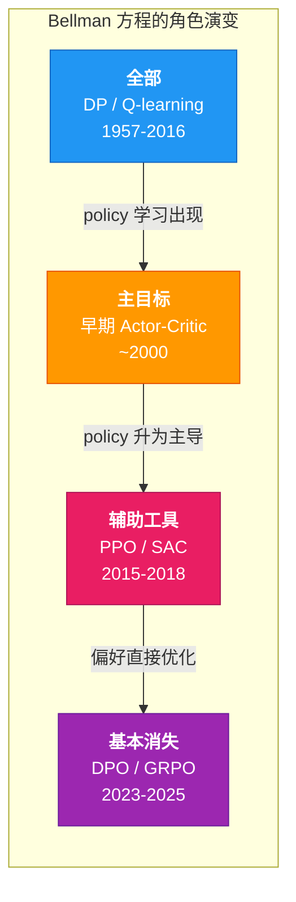

# 强化学习演化路线图：从 Bellman 方程到偏好学习

## 核心演化脉络

下图展示了 RL 从经典动态规划到现代偏好学习的**概念演化路径**，标注了每个阶段的核心转折点和 Bellman 方程所扮演角色的变迁。

```mermaid
flowchart TD
    subgraph ERA1["<b>阶段 1：确定性 DP（1957）</b>"]
        A["<b>Bellman 方程诞生</b><br/>Richard Bellman, 1957<br/>─────────────────<br/>V(s) = max_a [r + γ·V(s')]<br/>确定性环境，模型完全已知<br/>Bellman 方程 = 优化的全部"]
    end

    subgraph ERA2["<b>阶段 2：随机 DP / MDP（1960）</b>"]
        B["<b>随机动态规划</b><br/>Ronald Howard, 1960<br/>─────────────────<br/>V(s) = max_a E[r + γ·V(s')]<br/>引入转移概率 P(s'|s,a)<br/>Policy Iteration / Value Iteration<br/>Bellman 方程 = 优化的全部（随机版）"]
    end

    subgraph ERA3["<b>阶段 3：Model-Free V 学习（1988）</b>"]
        C["<b>TD Learning</b><br/>Richard Sutton, 1988<br/>─────────────────<br/>V(s) ← V(s) + α[r + γ·V(s') - V(s)]<br/>无需模型，从采样中学习<br/>V 稳定、方差低，但无法直接选 action<br/>Bellman 方程 = 优化的全部（采样近似版）"]
    end

    subgraph ERA4["<b>阶段 4：Q-learning / Qmax（1989）</b>"]
        D["<b>Q-Learning</b><br/>Chris Watkins, 1989<br/>─────────────────<br/>Q(s,a) ← r + γ·max_a' Q(s',a')<br/>从 V 转向 Q：显式记录 action 价值<br/>argmax Q 直接选动作，不再需要模型<br/>Off-policy、数据效率高<br/>Bellman 方程 = 优化的全部"]
    end

    subgraph ERA5["<b>阶段 5：Deep Q / 驯化 Qmax（2013-2016）</b>"]
        E["<b>DQN → Double DQN → Dueling DQN</b><br/>DeepMind, 2013-2016<br/>─────────────────<br/>发现 max 放大噪声 → overestimation<br/>Replay Buffer / Target Network / Double Q<br/>本质：给 Qmax 加缰绳<br/>Bellman 方程 = 优化的全部（加稳定技巧）"]
    end

    subgraph ERA6["<b>⚡ 转折点：引入 Policy 学习（1992/2000）</b>"]
        F["<b>REINFORCE / Policy Gradient Theorem</b><br/>Williams 1992 · Sutton et al. 1999<br/>─────────────────<br/>∇J = E[∇log π(a|s) · A(s,a)]<br/>开始直接优化 policy 分布<br/>但早期 Actor-Critic 中<br/>Critic 仍在逼近 Q，目标仍是 Bellman 一致性<br/>Bellman 方程 = 主目标（policy 是辅助手段）"]
    end

    subgraph ERA7["<b>⚡⚡ 关键转向：Policy 成为主导（2015-2018）</b>"]
        G["<b>TRPO → PPO → TD3 → SAC</b><br/>Schulman 2015/2017 · Fujimoto 2018 · Haarnoja 2018<br/>─────────────────<br/>优化目标：max E_π[R(τ)]（不是 Bellman 一致性）<br/>PPO: clip ratio 限制策略变化<br/>SAC: entropy bonus 防止 policy collapse<br/>TD3: 保守 double-Q 压制高估<br/>Bellman 方程 = 辅助工具（Critic 用它估 advantage）"]
    end

    subgraph ERA8["<b>⚡⚡⚡ 范式转变：偏好学习（2017-2025）</b>"]
        H["<b>RLHF → DPO → GRPO</b><br/>Christiano 2017 · Ouyang 2022 · Rafailov 2023 · DeepSeek 2025<br/>─────────────────<br/>Reward 来自人类偏好，非工程设计<br/>DPO: 直接在偏好对上优化，无需 reward model<br/>GRPO: 组内相对排序替代 Critic<br/>优化目标 = 偏好分布塑造<br/>Bellman 方程 ≈ 不再出现"]
    end

    A -->|"环境从确定变为随机<br/>但框架不变"| B
    B -->|"从已知模型到未知模型<br/>用采样替代精确期望"| C
    C -->|"从 V(s) 到 Q(s,a)<br/>action 优化显式化"| D
    D -->|"用深度网络扩展<br/>发现 max 不稳定"| E
    E -->|"为了修 Qmax<br/>引入 policy 网络"| F
    F -->|"policy 从辅助升为主目标<br/>Bellman 降为辅助"| G
    G -->|"reward 从工程设计<br/>变为偏好采样"| H

    style ERA1 fill:#e8f4f8,stroke:#2196F3,stroke-width:2px
    style ERA2 fill:#e8f4f8,stroke:#2196F3,stroke-width:2px
    style ERA3 fill:#e8f4f8,stroke:#2196F3,stroke-width:2px
    style ERA4 fill:#e8f4f8,stroke:#2196F3,stroke-width:2px
    style ERA5 fill:#fff3e0,stroke:#FF9800,stroke-width:2px
    style ERA6 fill:#fff3e0,stroke:#FF9800,stroke-width:2px
    style ERA7 fill:#fce4ec,stroke:#E91E63,stroke-width:2px
    style ERA8 fill:#f3e5f5,stroke:#9C27B0,stroke-width:3px
```

## Bellman 方程角色变迁一览

## 八个关键转折点（详细说明）

### 1. 起点：Bellman 方程（1957）

Richard Bellman 提出动态规划和最优性原理。在确定性、模型已知的世界里，Bellman 方程是充分必要条件——解出它就得到全局最优策略。这是整个 RL 的数学起点。

### 2. 随机化扩展：MDP 与 Policy Iteration（1960）

Ronald Howard 将 Bellman 框架扩展到随机环境（MDP），引入 Policy Iteration。框架本质未变——仍然是在已知模型下求 Bellman 方程的 fixed point——但允许了转移概率的不确定性。

### 3. 优先发展 V：TD Learning（1988）

Sutton 的 TD Learning 让 agent 可以在不知道模型的情况下从采样中学习 V(s)。V-function 被优先发展，因为它是对所有 action 的平均化表达，平滑、稳定、易证收敛。代价是：V 不能直接告诉你选哪个 action。

### 4. 从 V 到 Qmax：Q-Learning（1989）

Watkins 的 Q-learning 将学习目标从 V(s) 转向 Q(s,a)，让 action 选择变成简单的 argmax。这是巨大的飞跃——不再需要环境模型就能做控制。但核心公式仍然是 Bellman 方程的 Q 版本，max 算子仍然是优化的主角。

### 5. 发现 Qmax 不稳定，开始修补（2013-2016）

DQN 用深度网络扩展了 Q-learning，但也暴露了 max 算子在噪声估计下的致命弱点：overestimation、bootstrap instability。Double DQN、Dueling DQN、Target Network 等技术都是在 Bellman 框架内给 Qmax "加缰绳"。

### 6. 修 Qmax 的过程中引入了 Policy 网络（1992/2000 → 应用于 2015+）

为了解决 Q-learning 的不稳定性，人们引入了显式的 policy 网络（Actor-Critic）。早期 Actor-Critic 中，Critic 仍然在做 Bellman consistency fitting，policy 网络更像是一个"更好的 argmax 替代品"。**此时 Bellman 方程仍然是主目标，policy 是手段。**

### 7. 关键转向：Policy 优化成为主目标（2015-2018）

TRPO/PPO/SAC 标志着根本性转变。优化目标不再是 Bellman 方程的一致性，而是：

$$
\max_\theta \mathbb{E}_{\pi_\theta}[R(\tau)]
$$

Bellman 方程退居辅助角色——Critic 用它来估计 advantage，但它不再是优化的主公式。这是从 **"逼近真值 Q"** 到 **"塑造行为分布"** 的转向。

### 8. 偏好学习：Bellman 方程基本退场（2017-2025）

RLHF/DPO/GRPO 进一步推进了这个转变。Reward 不再是工程设计的数学函数，而是从人类偏好中采样得来。DPO 甚至完全消除了 reward model 和 RL 循环。GRPO 用组内相对排序替代了 Critic。

**Bellman 方程在这些方法中基本不再出现。** 优化目标变成了纯粹的偏好分布塑造——哪些行为被人类偏好，就增强它们的概率。

---

## 一句话总结

> **Bellman 方程从"优化的全部"逐步退化为"辅助工具"，最终在偏好学习中基本消失。这不是退步，而是 RL 从"上帝视角求解析最优"转向"有限采样下的统计偏好塑造"的必然结果。**
